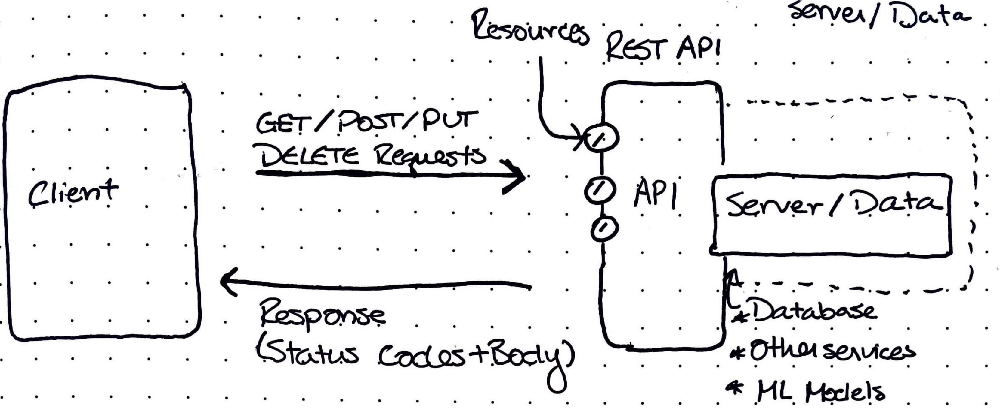
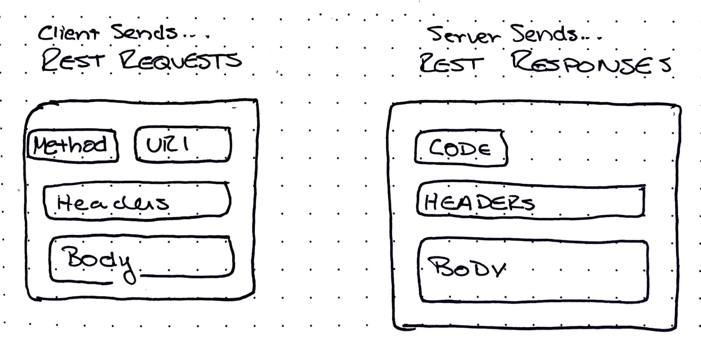

# Introduction to REST Architecture with Flask & Python

This is my attempt at a simple and useful introduction to RESTful services. Please note that this is designed from an engineer's perspective, and is in no way comprehensive. For more comprehensive information, please see the documentation linked at the bottom.

## What is REST
REST stands for REpresentation State Transfer and is a protocol used to communicate information over the Internet. Any time you use a web browser to visit a website, there is a very good chance information is being transferred over REST protocol.

A service, such as an API, is said to be *RESTful* if it conforms to the REST specification.

## Data Transfer Over the Internet

REST architecture uses a Request/Response paradigm where a **Client** sends a request to a **resource** on a REST API server, and the server sends a response that is *REpresentative* of the *State*, which is then *Transferred* to the client (hence **REST**!)

A REST API can be used to represent states of many different things and can contain lots of complex underlying logic. Some examples may include:
- Databases (Postgres, MongoDB, etc.)
- ML Algorithms
- EMR Jobs
- And even other REST services

### Rest Requests and Responses

REST Requests and Responses have certain elements to them that are necessary for the receiving service to understand the intent of the request,

**Requests** Contain:
- *method* - `GET`, `POST`, `PUT`, or `DELETE` (note: there are others that I will not discuss here), are the basic CRUD operations that describe what the client is trying to do to the resource (i.e. `GET` information, `POST` (create) a new resource, etc.)
- *uri* - the address of the resource, unique on the server (and on the internet). Where are you sending the request?
- *headers* - metadata about the request. For example, what data type is in the body (JSON, HTML, MIME media), authentication tokens.
- *body* - the meat of the request, the data. This may be in many formats, but in most use cases you can expect to see JSON.

**Responses** Contain:
- *Status Codes* - give information about how the request processing went. Some common ones are 200, 404, and 500. Generally, we want to see 200s.
- *headers* - same as above
- *body* - same as above

### Serialization and Deserialization
Data sent over REST often needs to be *serialized* upon sending and *deserialized* on the receiving side. This is because REST services send data in a serial format - this can be thought of as one long string, character by character.

JSON has become the standard for sending data over REST API requests (of course, other XML-like languages are also easily serialized). This was a convenient choice, as JSON stands for JavaScript Object Notation, and is the native data structure for front-end web applications. However, this also presents a problem, as JSON has a limited number of data types. This means it is not "round-trip" safe. For example, a `datetime` object in python has no comparable type in JSON, and would need to be serialized in a JSON compatible format, such as an ISO Timestamp String, then parsed on the receiving end.

This is where many libraries such as [Pydantic](https://github.com/pydantic/pydantic), [Marshmallow](https://marshmallow.readthedocs.io/en/stable/), and [Immutables](https://immutables.github.io) come in to define data models.
